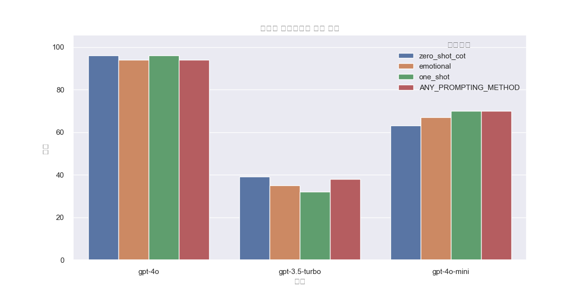

# GPT로 수능 국어 풀이

이번 주는 항해플러스 AI 코스의 4주차로, HuggingFace와 대규모 언어 모델(LLM)을 활용하여 더욱 깊이 있는 자연어 처리(NLP) 경험을 할 수 있는 소중한 시간이었습니다. 이전까지의 주차에서는 자연어 처리의 기초와 Transformer 계열의 모델들에 대해 학습했다면, 이번 주에는 HuggingFace를 통해 실질적으로 NLP 작업을 수행하고 다양한 심화 과제를 해결하며 LLM의 실질적인 활용 방법을 배우고 익혔습니다.

## HuggingFace가 제공하는 다양한 기능들

HuggingFace는 자연어 처리에서 빼놓을 수 없는 필수 라이브러리로, 특히 Transformer 기반의 다양한 모델들을 손쉽게 구현할 수 있게 해줍니다. 이번 주 학습을 통해 가장 유용했던 기능으로는 AutoModel 클래스, 미리 학습된 모델들이 담긴 HuggingFace Hub, 그리고 학습과 평가 전 과정을 관리하는 Trainer 클래스가 있었습니다.

먼저 AutoModel 클래스를 통해 손쉽게 다양한 자연어 처리 작업을 수행할 수 있었는데, AutoModelForSequenceClassification을 이용해 텍스트 분류 문제를, AutoModelForSeq2SeqLM을 통해 기계번역 문제를 해결할 수 있었습니다. 특히 AutoModelForCausalLM과 AutoModelForMaskedLM과 같은 클래스는 GPT나 BERT와 같은 모델들의 다양한 작업을 지원하여 더욱 효율적인 실험이 가능했습니다.

또한 HuggingFace Hub에서는 방대한 양의 pre-trained 모델과 데이터셋을 제공하여 데이터 준비와 모델 학습 시간을 크게 줄일 수 있었습니다. 학습 과정에서는 Trainer 클래스가 가장 큰 도움을 주었는데, 복잡한 학습 과정을 간소화하여 dataset과 모델만 준비하면 Trainer가 학습, 평가, 로깅을 자동으로 관리해주어 매우 편리했습니다.

## MNLI 과제를 통한 실습 경험

이번 주차의 기본 과제는 MNLI(Multi-Genre Natural Language Inference)를 해결하는 것이었습니다. MNLI는 두 문장 간의 논리적 관계를 Entailment, Neutral, Contradiction으로 분류하는 문제입니다. HuggingFace의 AutoModelForSequenceClassification을 활용해 빠르게 구현한 후, Trainer 클래스를 통해 다양한 하이퍼파라미터를 조정하며 최적화할 수 있었습니다. 이 과정에서 validation 데이터셋에 대한 정확도를 50% 이상 달성하며 실습을 성공적으로 마칠 수 있었습니다. 특히 이 과정에서 데이터 로딩과 전처리 과정이 간단하게 처리될 수 있어 HuggingFace의 효율성과 편리성을 다시금 실감할 수 있었습니다.

## GPT 모델을 활용한 심화과제

심화 과제로는 GPT-4와 다양한 프롬프팅 기법을 이용하여 2023년 수능 국어 문제를 직접 풀어보는 특별한 경험을 했습니다. 이 과제의 핵심 목표는 여러 프롬프팅 방식이 GPT 모델의 논리적 추론 능력에 어떤 영향을 미치는지 평가하는 것이었습니다. 이번 실험에서는 GPT-4o, GPT-4o-mini, 그리고 GPT-3.5-turbo 모델을 비교하여 성능 차이를 명확히 확인할 수 있었습니다.

특히 GPT-4o 모델은 zero-shot CoT(Chain-of-Thought)과 one-shot 방식에서 각각 96점으로 가장 높은 성과를 기록했으며, emotional 및 ANY_PROMPTING_METHOD에서도 94점을 기록하여 전반적으로 뛰어난 성능을 입증하였습니다. 이러한 결과는 GPT-4o가 추론 과정에서 단계별 사고 과정을 효과적으로 표현하고 문제 풀이의 정확성을 높일 수 있음을 보여줍니다. 실제로 CoT 기법을 적용했을 때 모델이 정답 도출 과정에서 추론 근거를 체계적으로 제공하여 높은 점수를 얻을 수 있었던 점이 인상 깊었습니다.

반면 GPT-3.5-turbo 모델은 zero-shot CoT에서 39점, emotional 35점, one-shot 방식에서 32점을 기록하며 전반적으로 낮은 성능을 보였습니다. 이는 모델의 규모와 훈련 데이터의 복잡성에서 비롯된 차이로 해석되며, 특히 복잡한 논리 추론 과정을 필요로 하는 국어 수능 문제에서는 GPT-3.5-turbo가 한계를 나타냄을 명확히 확인할 수 있었습니다.

GPT-4o-mini는 중간 성능을 나타냈는데, zero-shot CoT에서 63점, emotional 67점, one-shot 및 ANY_PROMPTING_METHOD 방식에서 70점을 기록하며 어느 정도 안정적인 성과를 보였습니다. 특히 GPT-4o-mini 모델은 프롬프팅 방식에 따라 일정한 성능 향상을 보였는데, 이를 통해 프롬프팅 전략이 중간 규모 모델에서도 효과적으로 성능을 높일 수 있는 핵심 요소임을 확인했습니다.

이러한 결과를 통해 대규모 언어 모델이 효과적인 프롬프팅 전략과 결합되었을 때 추론 정확도가 극대화될 수 있음을 경험했습니다. 또한 GPT-4o 모델의 우수한 성과는 LLM이 단순한 문장 생성뿐 아니라 복잡한 논리적 사고와 단계적 문제 해결 능력도 뛰어나게 수행할 수 있음을 입증하였습니다. 이번 심화 과제를 통해 각 모델의 강점과 약점을 명확히 이해하고, 앞으로 자연어 처리 과제를 수행할 때 최적의 모델과 전략을 선택하는 데 유용한 인사이트를 얻을 수 있었습니다.

## Text Classification과 다양한 Prompting 기법

이번 주에 특별히 깊이 있게 탐구한 부분 중 하나는 LLM을 활용한 Text Classification 기법이었습니다. Zero-shot과 Few-shot classification을 통해 적은 데이터만으로도 효과적으로 분류 작업을 수행할 수 있다는 사실을 확인할 수 있었습니다. 특히 Few-shot 기법은 몇 개의 예시만으로도 성능을 크게 향상시킬 수 있다는 점에서 인상 깊었습니다.

Prompting 기법 또한 다양하게 활용해보았습니다. Program-aided Language model(PAL) 기법을 통해 수학적 문제에서 계산 정확도를 높였으며, Retrieval-Augmented Generation(RAG)을 활용해 LLM이 거짓 정보를 최소화하고 신뢰성 있는 답변을 제공할 수 있게 했습니다. 이러한 기법들을 통해 LLM이 단순한 텍스트 생성뿐만 아니라 복잡한 문제 해결과 정확한 정보 제공 능력도 갖추고 있음을 실감할 수 있었습니다.

## 생산성을 높여주는 LLM 기반 개발 도구

LLM 기반 개발 도구로는 Github Copilot과 Cursor를 경험해 보았습니다. Github Copilot은 VSCode 환경과의 탁월한 통합을 통해 코드 자동 완성부터 리팩토링, 오류 해결 등 다양한 기능을 제공하여 개발 생산성을 극대화할 수 있었습니다. Cursor는 자체 IDE를 제공하여 큰 프로젝트에서도 원활하게 사용할 수 있었으며, 이를 통해 더욱 효율적인 개발 환경을 경험할 수 있었습니다.

또한 v0라는 툴을 통해 간단한 디자인이나 자연어만으로도 웹사이트를 손쉽게 제작할 수 있는 새로운 방식의 웹 개발도 체험했습니다. 이는 개발 프로세스를 획기적으로 단축시키는 매우 혁신적인 경험이었습니다.

## 4주차 학습을 마무리하며

이번 4주차 학습을 통해 HuggingFace와 LLM이 실제 실무 환경에서 얼마나 유용하고 강력한 도구인지 깊이 이해할 수 있었습니다. 다양한 실습과 과제를 통해 얻은 경험과 인사이트는 앞으로 더욱 복잡한 자연어 처리 문제들을 해결할 때 큰 도움이 될 것입니다. 앞으로도 지속적으로 HuggingFace와 LLM을 활용하여 다양한 도전 과제에 적극적으로 참여하고, 더욱 폭넓은 역량을 키워나가겠습니다.

긴 글을 끝까지 읽어주셔서 감사합니다.

항해 플러스 — 추천인 코드: CF7LUQ

#항해99 #항해플러스AI후기 #AI개발자 #LLM