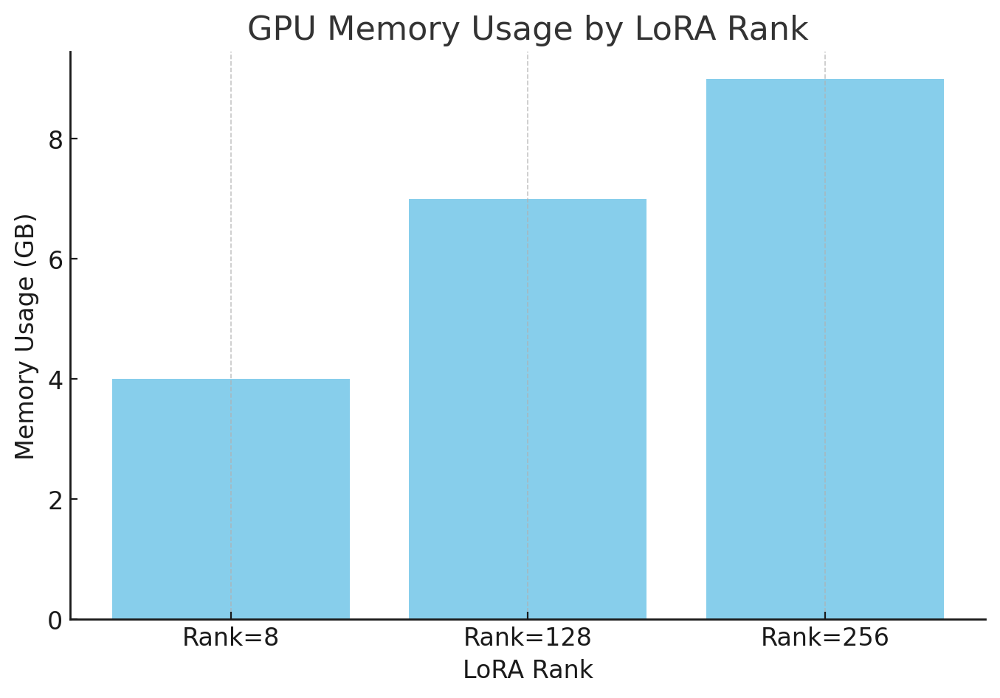
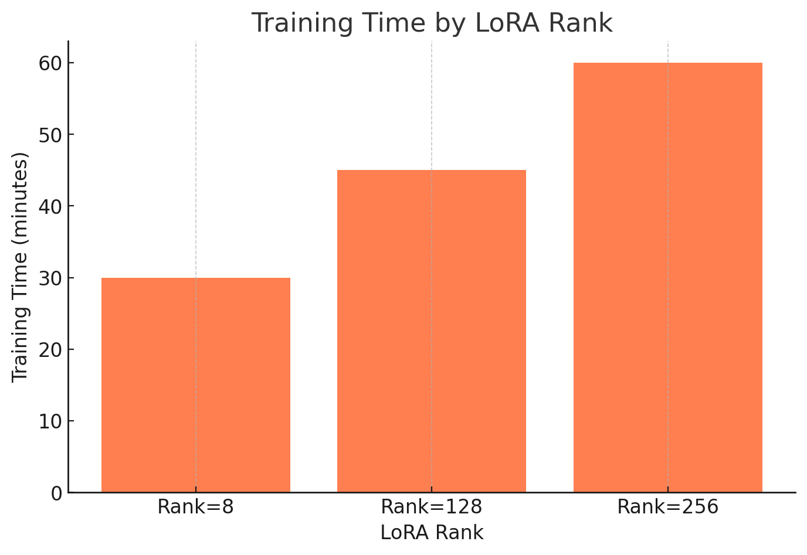

항해 플러스 AI 코스 8주차 후기

이번 항해 플러스 AI 8주차에서는 HuggingFace를 활용한 LoRA(Low-Rank Adaptation)의 다양한 Rank 설정에 따른 학습 성능을 분석하는 과제를 진행하며, Parameter-Efficient Fine-Tuning
(PEFT)의 효과와 Quantization, Data Parallelism, DeepSpeed 등 여러 가지 AI 학습 최적화 방법들을 깊게 탐구했습니다. 이번 글에서는 실습 과정과 그 결과에서 얻은 흥미로운 통찰을 공유하려 합니다.

### 📌 Quantization: Bit를 줄이면 성능이 떨어질까?

AI 모델을 효율적으로 활용하기 위해선 경량화 기술이 필수입니다. 그중 Quantization은 모델의 파라미터를 저장하는 데 필요한 비트(bit) 수를 줄여 메모리 사용량과 추론 속도를 크게 개선하는 방법입니다.

대표적인 Quantization 방법으로는 Float16, BFloat16, 4-bit Normal Float 등이 있습니다. 실습을 통해 AMP(Automatic Mixed Precision)를 사용하면 기존의 높은 정밀도와 낮은 정밀도를 혼합하여 성능 손실 없이 효율성을 얻을 수 있음을 확인했습니다. 특히 HuggingFace를 사용하여 간편하게 AMP를 설정하는 방법을 배웠고, 이를 통해 실제 실습에서 모델 성능 저하 없이 메모리 사용량을 줄일 수 있었습니다.

### 📌 Data Parallelism vs DeepSpeed

AI 모델이 커지면서 GPU 메모리 한계 때문에 원하는 크기의 배치 사이즈를 처리하기 어려운 경우가 있습니다. 이를 해결하기 위해 사용되는 방법 중 하나가 Data Parallelism입니다. 이 방법은 여러 GPU에 같은 모델을 복사하고 배치를 나눠 각 GPU에서 독립적으로 gradient를 계산한 후 수합하여 학습합니다.

하지만 Data Parallelism은 모델의 중복된 메모리 사용과 GPU의 메모리 한계 등 여러 단점을 가지고 있었습니다. 이를 해결하기 위해 Microsoft에서 개발한 DeepSpeed가 있습니다. DeepSpeed의 ZeRO(Zero Redundancy Optimizer)는 파라미터, gradient, optimizer 상태를 나누어 중복을 최소화하고 CPU Offloading을 통해 GPU 메모리 한계를 극복하는 혁신적인 방법을 제공합니다.

이번 주 DeepSpeed 실습을 통해 Stage-2, Stage-3 등 다양한 설정을 시험하며 GPU 메모리를 효율적으로 활용할 수 있었고, 그 결과 같은 하드웨어에서 더 큰 모델과 더 큰 배치 사이즈를 처리할 수 있었습니다.

### 📌 LoRA Rank에 따른 성능 차이 실습

이번 주의 핵심 과제는 LoRA의 Rank 값을 변화시켜 학습 성능과 메모리 사용량을 비교하는 것이었습니다. LoRA는 전체 모델의 파라미터가 아닌 낮은 차원의 두 행렬로 표현된 파라미터만 업데이트하여 학습 효율성을 높이는 방법입니다.

Rank 값에 따라 8, 128, 256을 설정하여 각각의 모델 학습을 진행한 후 Wandb를 활용하여 loss 곡선과 학습 속도, GPU 메모리 사용량을 비교했습니다. 다음은 실험 결과입니다.

Rank=8일 때:

빠른 학습 속도와 낮은 메모리 사용량을 보였습니다.

loss는 초반 빠르게 떨어졌으나 일정 수준에서 정체되었습니다.

Rank=128일 때:

Rank=8보다 loss가 더 많이 감소하며 성능이 향상되었습니다.

그러나 학습 속도가 느려지고 메모리 사용량이 증가했습니다.

Rank=256일 때:

가장 높은 메모리 사용량과 가장 느린 학습 속도를 보였습니다.

loss 개선 폭은 Rank=128과 큰 차이가 없었으며, 오히려 효율성 측면에서 손해가 있었습니다.

메모리 사용량을 측정하는 코드는 다음과 같았습니다.

print('Max Alloc:', round(torch.cuda.max_memory_allocated(0)/1024**3, 1), 'GB')

### 📌 LoRA의 장단점 분석

실습을 통해 얻은 LoRA의 장단점은 명확했습니다.

장점:

적은 메모리 사용으로 큰 모델도 효율적으로 학습 가능합니다.

빠른 학습 속도와 낮은 비용으로 모델 성능을 상당히 끌어올릴 수 있습니다.

단점:

Rank 값을 높일수록 메모리 사용량과 학습 시간이 급격히 증가하며 효율성이 떨어집니다.

지나치게 낮은 Rank 값은 모델 성능 향상에 한계가 있습니다.

이러한 점을 고려해 실제 프로젝트에서는 적절한 Rank 값을 설정하는 것이 매우 중요합니다.

### 📌 FlashAttention: 긴 텍스트 학습의 최적화

마지막으로, 긴 텍스트를 효율적으로 처리할 수 있게 해주는 FlashAttention 기술을 소개받았습니다. FlashAttention은 Attention 계산을 최적화하여 메모리 사용량을 극적으로 줄이고 GPU의 빠른 SRAM을 활용해 학습 속도를 높이는 혁신적인 기술입니다.

실습에서는 HuggingFace 모델에 간단한 설정으로 FlashAttention을 활성화하여 긴 컨텍스트를 더 빠르고 효율적으로 학습할 수 있었습니다. 이를 통해 실제 서비스 환경에서도 매우 유용하게 적용될 수 있음을 확인했습니다.

### 📌 마무리하며

이번 주차 실습은 다양한 최적화 기술을 통해 제한된 하드웨어 환경에서도 효율적으로 모델을 학습할 수 있는 기술을 익힌 값진 경험이었습니다. Quantization, LoRA, DeepSpeed, FlashAttention 등 다양한 방법론들을 실습하며 모델 경량화와 효율성 개선을 위한 깊이 있는 이해를 얻을 수 있었습니다.

특히 LoRA의 Rank 값 변화에 따른 실험을 통해 실질적인 성능 최적화 방안을 체득했고, 앞으로 모델 개발과 학습 과정에서 매우 유용한 전략으로 활용할 수 있을 것 같습니다.

앞으로도 다양한 실습과 실험을 통해 더 나은 AI 개발자가 될 수 있도록 노력하겠습니다.

항해 플러스 — 추천인 코드: CF7LUQ

#항해99 #항해플러스AI후기 #AI개발자 #LLM

