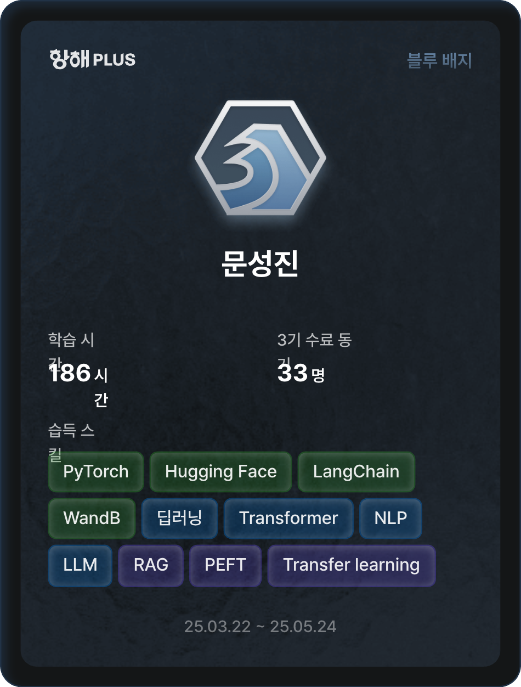

## 항해 플러스 AI 코스 수료식 후기

5월에 수료를 했지만, 그동안 바빠서 미뤄왔던 수료식 후기를 이제서야 작성해 보려고 한다.
나는 3월 22일부터 5월 24일까지 약 두 달간 항해 플러스 AI 코스를 수강했다!

### 용어의 생소함

처음 AI 코스를 수강했을 때, 한 번도 들어보지 못한 용어들과 낯선 기술들을 접할 때마다 굉장히 어렵게 느껴졌다. 특히 모델 학습, 추론, 임베딩 등 평소에 쓰지 않던 용어들이 많아 처음에는 강의를 따라가기 힘들었다. 용어를 제대로 모르니 코치님의 설명이나 학습 메이트들이 주고받는 질문과 답변을 이해하는 데에도 어려움을 겪었다. 하지만 계속해서 용어를 익히고 개념을 정리하다 보니 어느 순간부터 코치님과 팀원들과의 소통이 자연스러워졌고, 내용을 보다 깊이 있게 이해할 수 있었다.

### 우리 팀

우리 팀은 정말 최고의 팀워크를 자랑했다! 처음 만났을 때는 다들 낯설고 어색했지만, 스터디와 과제를 함께 하며 금방 친해졌다. 특히 매주 진행되는 팀 프로젝트와 스터디 세션에서 서로 적극적으로 의견을 주고받았고, 모두가 성실히 참여했기 때문에 더욱 의미 있고 유익한 시간이 되었다. 팀원 모두가 끝까지 책임감을 가지고 서로 도와가며 과제를 완성한 덕분에, 좋은 결과로 마무리할 수 있었다.

### 목표

우리 팀의 목표는 단순히 개인이 수료하는 것이 아니라, 팀 전원이 함께 끝까지 완주하여 베스트 팀으로 선정되는 것이었다. 팀원들 모두 이 목표를 공유하고 있었기 때문에 마지막까지 서로 격려하며 최선을 다할 수 있었다. 덕분에 수료까지 아무도 포기하지 않았고, 끝까지 함께 노력하는 과정에서 정말 값진 경험을 얻었다.

### 마무리

비록 블루 배지를 받았지만, AI 개발자로서 많은 것을 배웠다. 요즘 많은 애플리케이션들이 AI를 적극적으로 도입하고 있는 만큼, 개발자에게도 AI 활용 능력은 필수적인 시대가 되었다. 특히 GPT나 Claude와 같은 상용 API는 비용적인 부담이 크기 때문에, 앞으로는 비용 효율적인 오픈소스 LLM 모델을 직접 가져와 학습시키고 이를 애플리케이션에 접목할 줄 알아야 경쟁력이 생긴다. 이번 코스를 통해 그런 기술적 자신감을 얻었다는 점에서 매우 만족스러웠다.

이번 기수가 끝으로 다음 기수부터는 MCP로 커리큘럼이 변경되어 개인적으로 아쉬운 마음이 있지만, 그럼에도 불구하고 이번 항해 플러스 AI 코스를 통해 개발자로서 확실히 한 단계 더 성장했다고 느낀다.

### 항해 플러스 할인 받기!

항해 플러스 코스에 참여할 때 할인 코드를 입력하면 20만원 할인을 받을 수 있다!

추천 코드: CF7LUQ